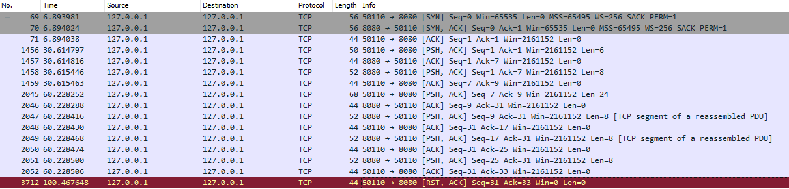
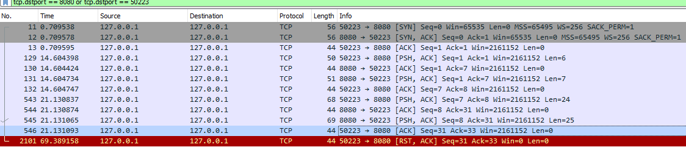
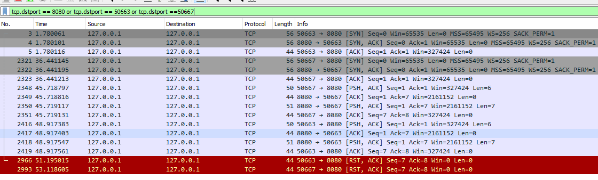
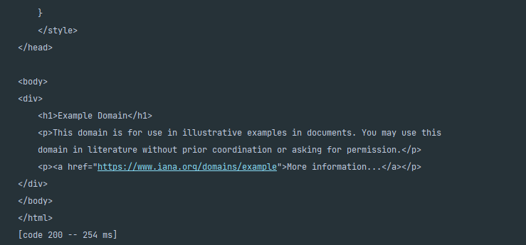
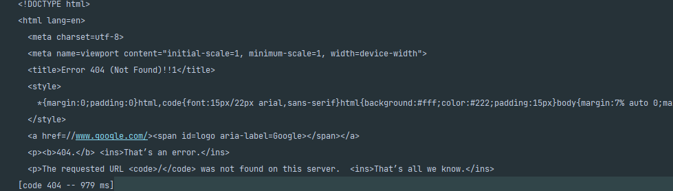

# Compte-rendu TP1 IPR

### Ammar KAZEM et Dylan Dupond

#### Partie 1: Version Séquentielle

##### Exercice 2: Test et Capture

Le texte échangé est bien visible grâce à WireShark. Les packets sont normalement en bytes et donc pas lisible directement, mais WireShark nous les traduit en lettre affin de pourvoir voir le contenu des message plus facilement.

Dans le cas du `ClientHandlerBytes` tout débordement du buffer est envoyé dans un autre paquet. Dans notre exemple le message "how are you doing today" a été envoyé en deux paquets, comme vous pouvez le voir dans l'image (1).

*Image (1)*

En utilisant `BufferedReader` et `PrintWriter` tous le message est envoyé dans un seul paquet comme vous pouvez le constater dans l'image (2).

*Image (2)*

##### Exercice 3: Version multithreadée

Dans l'image (3) nous pouvons constater que deux clients sont connectés en même temps au serveur echo (sur le port 50663 et le port 50667).

*Image (3)*

#### Partie 2: Implémentation d'un client HTTPPING

##### Exercice 1: Analyse du protocole HTTP

- **Coté requète**

    - 1. La première ligne contient la méthode de communication à utiliser (HTTP/1.1 dans notre cas).

    2.  **Accept-Encoding:** Permet de de définir quel sera l'encodage du contenu. **Connection: keep-alive:** "Connection" permet de décider si la connection est maintenu après que la transaction est terminée. "keep-alive" garde la connection ouverte pour permettre d'autres requêtes vers le serveur.

- **Coté serveur**

    - 1. "HTTP/1.1 200 OK" cette ligne informe le client que tout est OK et que le serveur utilisera le protocole HTTP/1.1 pour communiquer.

    2. "https://github.com/sqfsdqfsdf" a une réponse 404.

    3. Le client commence par envoyé ses informations de communication au serveur (le protocole utilisé, le navigateur, type de connection, les langues, l'encodement des caractères... ). Le serveur y répond en confirment si tout les paramètres de connection demandés par le client sont bonnes ou pas et en ajoutant quelque informations telles que le type du contenu, la dernière date de modification, la taille du contenu, ...

##### Exercice 2: Récupération d'une page avec netcat

- "HTTP/1.0 501 Not Implemented" non example.com ne supporte pas le protocole HTTP/1.0

- "iso-8859-1" est l'encodage utilisé pour le type de retour

- Rien ne se passe dans notre cas

##### Exercice 3: Implémentation du HTTP ping

Example de résutat:

##### Exercice 4: Socket securisée

Example de résutat:

#### Partie 3: Implémentation d'un serveur HTTP simple